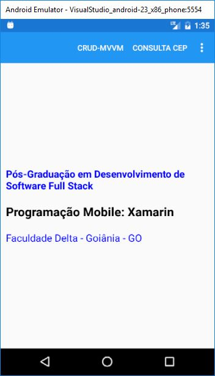
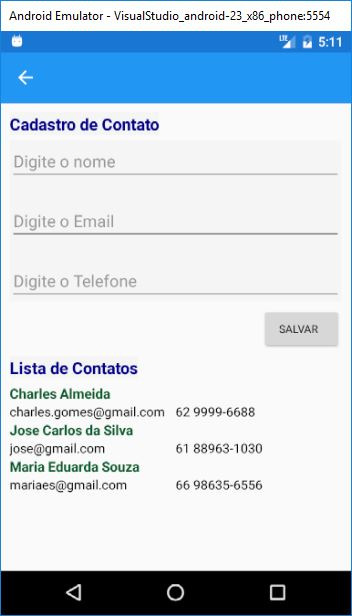
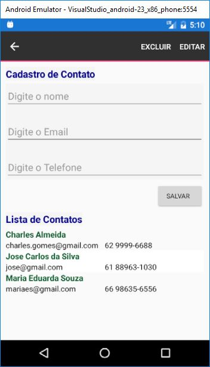
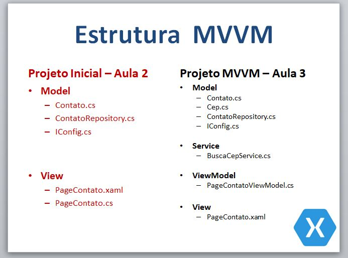
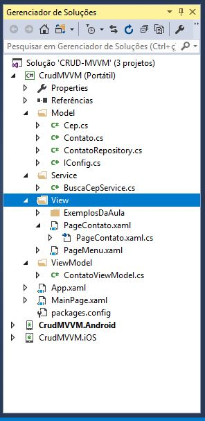
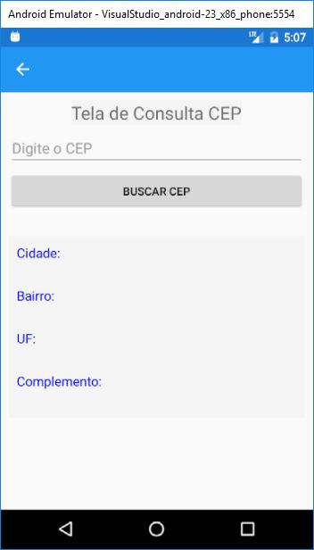
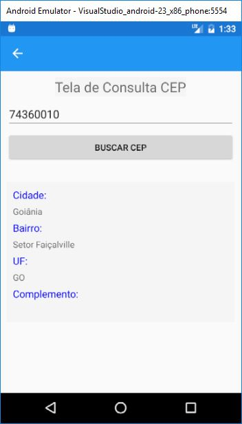
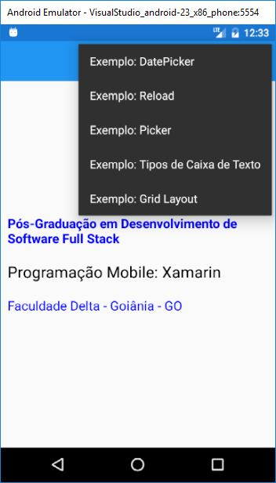
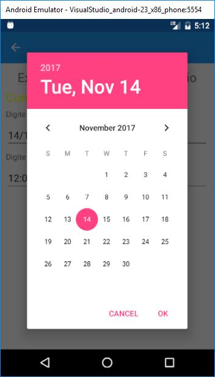
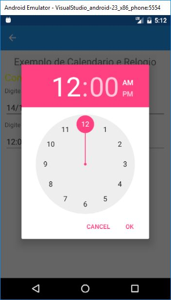

# Programação Mobile: Xamarin

Material utilizado na última aula da Disciplina: **Programação Mobile (Xamarin) da Especialização em Desenvolvimento de Software Full Stack**, Faculdade Delta, Goiânia - Goiás.
 
**Principais requisitos do projeto CRUD-MVVM:**
* **IDE:**
  * Visual Studio 2017.
* **Packages:**
  * Xamarin.Forms;
  * Newtonsoft.Json;
  * SQLite-Net-PCL;
  * System.Net.Http.

**Tela Principal do projeto: CRUD SQLite e MVVM:**

**Tela de Cadastro de Contato:**

**Edição e Exclusão de Contato:**

**Conversão do **CRUD-Básico** para **CRUD-MVVM**:**

**Estrutura do projeto utilizando o padrão MVVM:**

**Xamarin - Consumindo Web Service:**
 
* WebSevice utilizado no exemplo abaixo para consulta de CEP online na base de dados dos correios.
  * **ViaCEP - Webservice CEP e IBGE gratuito:** https://viacep.com.br/ws/01001000/json/
* **Tela de consulta CEP:**

 **Retorno da consulta CEP:**

  
  
 
**Tela utilizando o ToolBarItem do Xamarin.Forms:**

**Tela utilizando o DatePicker do Xamarin.Forms**

* Opção de utilizar o calendario ou digitar a data para preencher o campo.

**Tela utilizando o DatePicker do Xamarin.Forms**

* Opção de utilizar o Regolio ou digitar a hora para preencher o campo.

# Referências Bibliográficas

* **Xamarin Forms: Exemplos**
  * https://developer.xamarin.com/samples-all/
* **Xamarin.Forms: Controls, Pages e Layouts**
  * https://developer.xamarin.com/guides/xamarin-forms/user-interface/controls/
* **Xamarin: MVVM**
  * https://developer.xamarin.com/guides/xamarin-forms/xaml/xaml-asics/data_bindings_to_mvvm/
* *Xamarin: SQLite*
  * https://developer.xamarin.com/guides/android/application_fundamentals/data/part_3_using_sqlite_orm/
* **Web Service : Rest**
  * https://developer.xamarin.com/guides/xamarin-forms/cloud-services/consuming/rest/
  * https://developer.xamarin.com/guides/cross-platform/application_fundamentals/web_services/
  
  
